<picture>
  <source media="(prefers-color-scheme: dark)" srcset="assets/header-dark.svg">
  
</picture>

  

<picture>
  <source media="(prefers-color-scheme: dark)" srcset="assets/card-dark.svg">
  
</picture>

  

<picture>
  <source media="(prefers-color-scheme: dark)" srcset="https://raw.githubusercontent.com/driftn0de/driftn0de/output/heatmap-dark.svg">
  
</picture>

self-generated SVGs · no third-party widgets · heatmap refreshed daily by GitHub Actions

